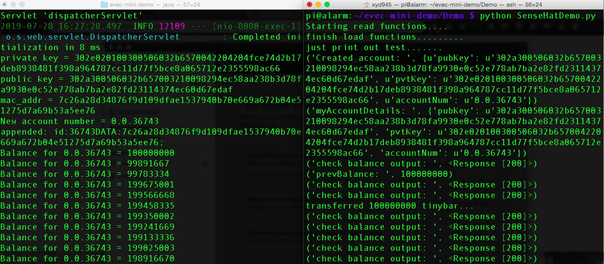
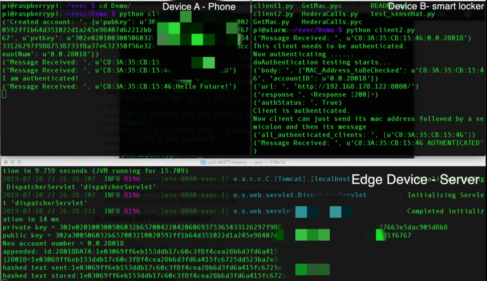
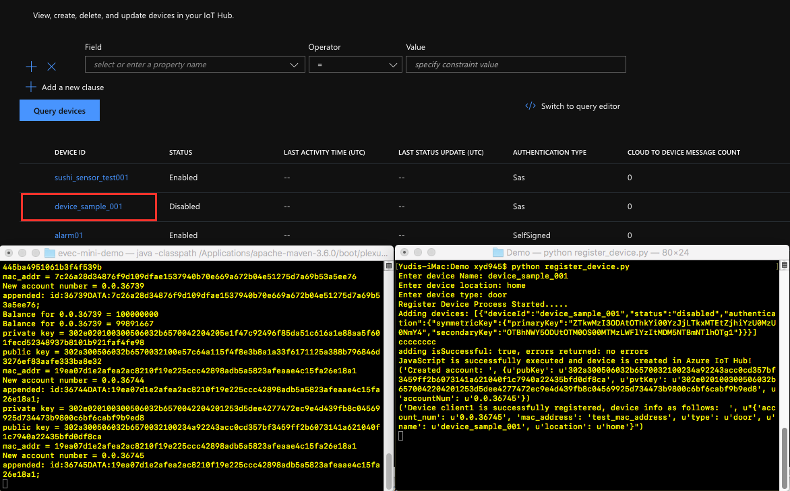

# Demo Code

## Explanation

### SenseHAT demo
In this demo, a new account is created by the file SenseHatDemo.py, with inital balance of 100,000,000 tiny bar. Every few seconds, the code will transfer some Hbars to the IoT device, and check if the balance has increased every 2 second. If balance has increased, it blinks the Led, otherwise it is off.

### Edge device demo

client1 - A (you can think it as a phone or an IoT button)
client2 - B (a smart locker at your home)

**What is happening?**
* A is the sending client. B is the receiving client
* A creates an account on hedera using the rest api and stores its MAC address on hedera file.
* A first sends a message (via MQTT) in the format **"A_MAC_address;A_hedera_account_id"**.
* B hears this. checks if message format is valid. Then checks if the MAC address in the message has previously been authenticated by it. (If it has - this is where you may add your code). If it hasn't, then B calls REST API to talk with Hedera to match the MAC address it received against the account number in the message. If the API says the MAC address sent matches with the one stored on Hedera File, then B broadcasts that A is authenticated.
* A, on hearing this, can now send the actual messages it wanted to send to B (this is where you can add your code)

### Cloud integration
If you have Microsoft Azure Cloud account, you can try out the register_device.py function to register deivce both in Hedera and Azure IoT Hub. More info of how to setup IoT Hub can be found [here](https://docs.microsoft.com/en-us/azure/iot-hub/iot-hub-create-through-portal).

## Quick Recap on how to run:

Just as a recap to run the demo from start:

1. Ensure you have prerequisites installed and you filled the .env file correctly
2. from parent directory (on your laptop) run ` $ mvn spring boot:run`
3. Add the newly generated file number in the .env file
4. Run ` $ mvn spring boot:run` and wait for console to output "You may call REST APIs now"
5. Now run `client2.py` followed by `client1.py`

**Note** - when running on IoT device, don't forget to uncomment `line 7 of client1.py` (to get the MAC address)
