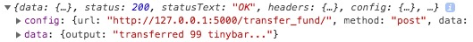

First move the front-end project directory
`cd` `evec-mini-demo/webApp/front-end/evec`

Install required dependencies
`npm install`

## Available Scripts

In the project directory, you can run:

`npm start`

Runs the app in the development mode. 
Open [http://localhost:3000](http://localhost:3000) to view it in the browser.

The page will reload if you make edits. 
You will also see any errors in the console.

Currently, we haven't implemented any display or good-looking UI, so you have to turn on the browser console to check the return data. 

